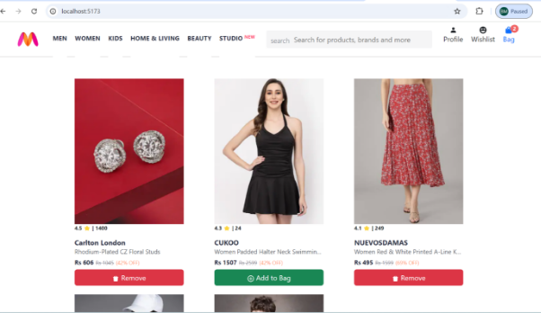
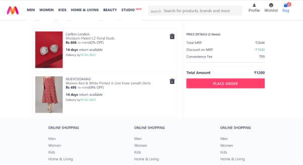
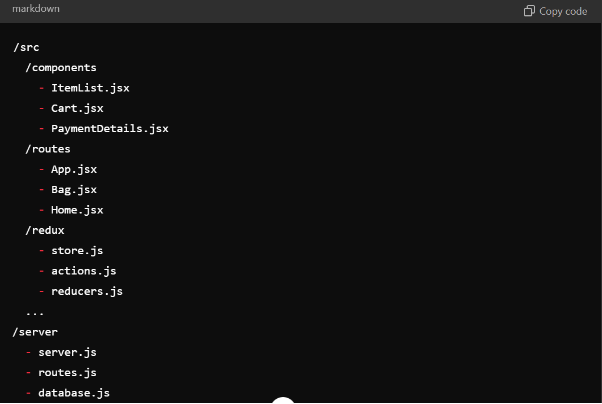

# **E-Commerce Web Application**

This is a full-stack e-commerce web application that allows users to browse items, add them to a cart, and proceed to payment. The frontend is built using **ReactJS** and **Bootstrap** for responsiveness, while the backend utilizes **NodeJS** and **ExpressJS** for API creation, state management, and routing. **Redux** is used for managing global state, and custom databases store item details and user selections.

## **Features**

- **Browse Items**: Users can view a list of available items.
- **Add to Cart**: Items can be added to the cart, and the state is updated dynamically using **Redux**.
- **View Cart**: Users can view selected items, along with payment details on a separate page.
- **Responsive Design**: The app is responsive across different devices, built with **Bootstrap**.
- **Custom Backend**: The app communicates with a custom-built database using APIs created with **NodeJS** and **ExpressJS**.
- **State Management**: **Redux** is used to manage the global state across components.
- **Routing**: **React Router** handles the navigation between different pages.

## **Project Preview**

## **Tech Stack**

**Frontend**

- **ReactJS**: Frontend library used to build the user interface.
- **Bootstrap**: For responsive design and layout.
- **React Hooks**: Used for managing component-level state and lifecycle methods.
- **Redux**: For global state management.

**Backend**

- **NodeJS**: Backend runtime environment.
- **ExpressJS**: Middleware for routing and handling requests.
- **Custom Database**: Stores e-commerce item data.

**API**

- **NodeJS** and **ExpressJS** generate APIs that interact with the custom database, fetching item data and updating cart information.

## **Project Structure**

## **Usage**

1. Open the app in the browser:

`               `http://localhost:3000

1. Browse the items on the homepage.
1. Add items to the cart by clicking "Add to Cart."
1. View selected items by navigating to the cart page.
1. Proceed to the payment page, where selected items and total cost will be displayed.

## **Future Enhancements**

- Implement user authentication (e.g., using Firebase).
- Add more payment gateways.
- Enhance the user interface with additional animations and transitions.
- Add search and filter functionality for easier navigation through items.

